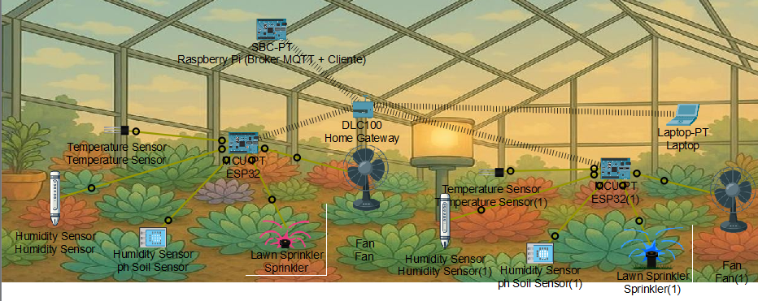
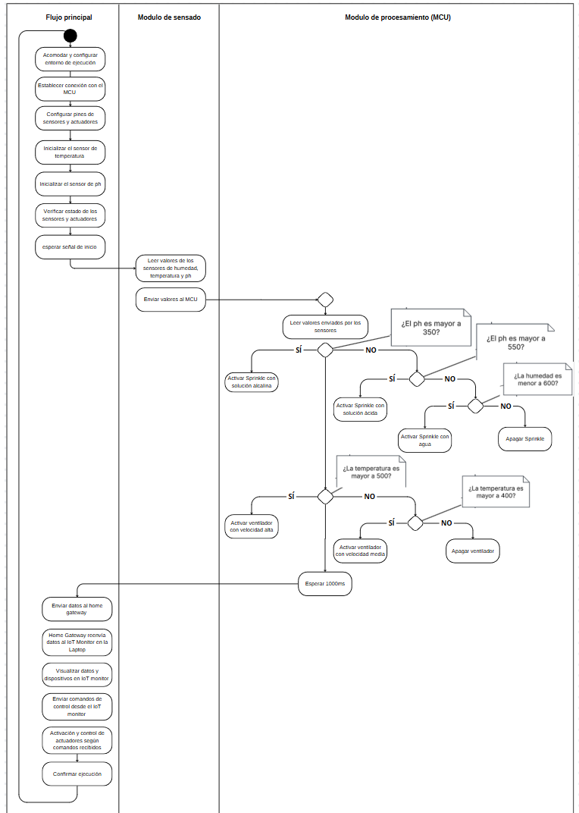
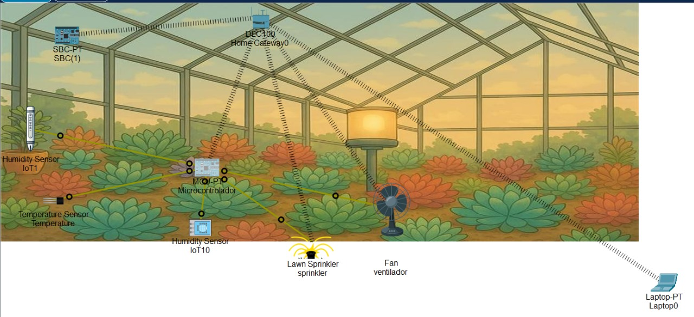

# Implementación del MVP de IoT en Cisco Packet Tracer

## Información de la actividad
- **Universidad:** Universidad de La Sabana  
- **Facultad:** Facultad de Ingeniería  
- **Materia:** Internet de las Cosas  
- **Profesor:** Juan Manuel Aranda López King  

## Integrantes del Proyecto
| Nombre | Correo Electrónico |
|--------|-------------------|
| Valentina Alejandra López Romero | valentinalopro@unisabana.edu.co |
| Ana Lucía Quintero Vargas | anaquiva@unisabana.edu.co |
| Mariana Valle Moreno | marianavamo@unisabana.edu.co |

## Estructura de la Documentación
- [1. Introducción](#1-introducción)
- [2. Justificación del Proceso Seleccionado](#2-motivación-y-justificación-del-proceso-seleccionado)
- [3. Diseño del MVP y Tecnologías Seleccionadas](#3-diseño-del-mvp-y-tecnologías-seleccionadas)
- [4. Implementación en Cisco Packet Tracer](#4-implementación-en-cisco-packet-tracer)
- [5. Conclusión](#5-conclusión)
- [6. Referencias](#6-referencias)
- [7. Anexos](#7-anexos)

---

## 1. Introducción
<p align="justify">
Actualmente, el Vivero Plantaciones Ravelo, ubicado en Chía, no cuenta con un sistema automatizado para el riego y cuidado de sus cultivos, lo que limita su capacidad de respuesta ante cambios en temperatura, humedad y otras condiciones ambientales, lo que puede afectar la eficiencia operativa y el crecimiento óptimo de las plantas.
</p>

<p align="justify">
Para abordar esta problemática, se identificó la zona de cultivo en bandejas de plantas ornamentales dentro del invernadero como el área ideal para implementar una solución basada en Internet de las Cosas (IoT). A diferencia de las plantas en bolsas de tierra, las bandejas comparten sustrato, lo que facilita una distribución eficiente de sensores y una mejor gestión del riego.
</p>

<p align="justify">
Como primer paso, se plantea desarrollar un Producto Mínimo Viable (MVP) enfocado en la conectividad, asegurando que los sensores de temperatura ambiente, humedad del suelo y pH del sustrato transmitan datos de forma eficiente al sistema de control. El monitoreo automatizado de estas variables permitirá optimizar el uso del agua, mejorar el rendimiento de los cultivos y reducir el desperdicio de recursos, generando un entorno más eficiente y sostenible [1]. 
</p>

<p align="justify">
Para validar la funcionalidad del sistema, se utilizará Cisco Packet Tracer  como herramienta de simulación para comprobar la comunicación entre sensores y sistema de control antes de una posible implementación real, asegurando que la infraestructura propuesta sea efectiva en la optimización de recursos y la gestión del riego.
</p>

---

## 2. Motivación y Justificación del Proceso Seleccionado
<p align="justify">
 La automatización del riego en viveros representa un desafío que requiere un monitoreo constante para optimizar el uso del agua y garantizar condiciones óptimas para el desarrollo de los cultivos. Actualmente, este proceso se realiza de forma manual en la empresa, lo que incrementa el riesgo de desperdicio de recursos y limita la eficiencia en la gestión del riego. La implementación de sistemas de irrigación de precisión permite optimizar el consumo de agua, reducir costos operativos y mejorar la calidad de los cultivos, generando beneficios tanto para el productor como para el medioambiente [2].
</p>

Para abordar esta problemática, la integración de una solución basada en Internet de las Cosas (IoT) ofrece ventajas significativas:
- **Mayor eficiencia operativa:** Reduce la intervención humana en el proceso de riego.
- **Uso eficiente del agua:** Evita desperdicios al activar el sistema solo cuando sea necesario y previene el estrés hídrico en las plantas [2].
- **Monitoreo y control remoto:** Permite supervisar en tiempo real las condiciones del cultivo desde cualquier ubicación.

<p align="justify">
El Producto Mínimo Viable (MVP) incorporará sensores de **humedad del suelo, temperatura ambiente y pH del sustrato**, variables clave para la automatización del riego y la optimización del cultivo.
</p>

---

## 3. Diseño del MVP y Tecnologías Seleccionadas

### Arquitectura propuesta
<p align="justify">
El Producto Mínimo Viable (MVP) se basa en una arquitectura IoT híbrida y distribuida, estructurada en cuatro componentes clave: percepción, computación, conectividad y analítica/visualización. Se integra una combinación de tecnologías Zigbee y Wi-Fi/Ethernet para garantizar eficiencia energética, escalabilidad y estabilidad en la transmisión de datos dentro del vivero.
</p>

### Componentes principales
#### 1. Percepción
  - **Sensores IoT:** Monitorean humedad del suelo, temperatura ambiente y pH del sustrato en las bandejas de cada mesa del cultivo ornamental, facilitando un monitoreo colectivo preciso.
  - **Actuadores (válvulas de riego y ventiladores):** Ejecutan acciones físicas en función de las decisiones tomadas por el sistema. Las válvulas controlan el paso de agua y soluciones ácidas o alcalinas hacia el cultivo, mientras que el ventilador se activa para regular la temperatura cuando se superan ciertos umbrales definidos.
    - Ambos actuadores reciben señales digitales desde el microcontrolador, respondiendo de forma automatizada a las condiciones monitoreadas por los sensores, lo que permite una gestión eficiente y precisa del ambiente dentro del vivero.

#### 2. Computación
  - **Microcontroladores (MCU):** Procesan los datos recibidos desde los sensores y los transmiten a la Raspberry Pi utilizando Zigbee, donde estos dispositivos funcionan como sistemas embebidos de bajo consumo.
  - **Raspberry Pi (Gateway IoT y Broker MQTT):** Coordina la red Zigbee local, gestionando la comunicación entre los microcontroladores distribuidos. Además, actúa como broker MQTT, permitiendo la publicación y suscripción de mensajes entre los sensores, actuadores y la interfaz de usuario. También tiene la capacidad de ejecutar software ligero para realizar tareas de preprocesamiento de datos o verificación de conectividad local, aprovechando los principios de la computación en el borde (Edge Computing).

#### 3. Conectividad
  - **Red Zigbee:** Conecta los sensores y microcontroladores dentro del sistema, proporcionando baja latencia, consumo energético reducido y alta confiabilidad incluso en entornos con interferencias. Su topología mallada y el uso de bandas de frecuencia como 2.4 GHz, 868 MHz o 915 MHz permiten una cobertura extendida y estable en todo el vivero [4].
  - **Wi-Fi / Ethernet (comunicación con clientes y dispositivos externos):** Facilita la comunicación entre la Raspberry Pi y la interfaz de usuario, permitiendo acceso remoto y transmisión eficiente de datos.
  - Wi-Fi es la opción preferida en zonas donde no es viable realizar cableado, mientras que Ethernet ofrece una conexión más estable y de mayor velocidad en áreas con señal inalámbrica débil. Ambas tecnologías permiten la transmisión eficiente de datos hacia los dispositivos de monitoreo remoto.

#### 4. Analítica y Visualización
  - **Raspberry Pi como broker y gestor de datos:** Recibe y organiza los datos de los sensores, permitiendo la activación de actuadores en función de los valores monitoreados. También puede almacenar registros locales para un análisis posterior si la conexión a internet se ve interrumpida.
- **Interfaz Web / Dashboard:** Permite al observador remoto, es decir, al personal del vivero, monitorear en tiempo real el estado del sistema, accediendo a la visualización de datos, alertas, umbrales y estadísticas clave para una gestión eficiente del riego y las condiciones del cultivo.

### Tecnologías de Comunicación
<p align="justify">
Se ha optado por una combinación de Zigbee y Wi-Fi/Ethernet, cada uno con un propósito específico definido dentro de la arquitectura del MVP:
</p>

#### Zigbee (Comunicación interna entre sensores, microcontroladores y Raspberry Pi):
- **Bajo consumo energético:** Ideal para sensores distribuidos que operan durante largos periodos sin necesidad de recarga o reemplazo frecuente de baterías.
- **Topología de red mallada:** Permite la comunicación entre múltiples nodos sin depender de un único punto de acceso, lo que mejora la cobertura en el vivero y proporciona tolerancia a fallos [4].
- **Alta confiabilidad en la transmisión:** Implementa mecanismos de reintento de paquetes y corrección de errores, garantizando la integridad de los datos incluso en entornos con interferencias.
- **Técnicas de mitigación de interferencias:** Emplea salto de frecuencia en bandas como 2.4 GHz, 868 MHz o 915 MHz, lo que evita colisiones con otros dispositivos inalámbricos [4].
- **Seguridad integrada:** Utiliza cifrado de datos y autenticación para evitar accesos no autorizados [4].
- **Optimizado para monitoreo ambiental:** Opera a velocidades adecuadas para el envío eficiente de datos de sensores sin sobrecargar el sistema [4].

#### Wi-Fi / Ethernet (Comunicación externa entre Raspberry Pi y clientes MQTT):
- **Wi-Fi:** Brinda una solución inalámbrica flexible en zonas del vivero donde no es factible el cableado, permitiendo movilidad y rápida implementación.
- **Ethernet:** Ofrece una conexión más estable, con menor latencia y mayor velocidad en áreas donde la señal Wi-Fi es débil o la interferencia es frecuente.
- **Ambas tecnologías:** Permiten la comunicación eficiente entre la Raspberry Pi y los clientes MQTT, asegurando la disponibilidad de los datos en tiempo real para supervisión y control remoto del sistema.

<p align="justify">
Otras tecnologías como Bluetooth Low Energy (BLE), LoRa y redes móviles (4G/5G) fueron descartadas debido a sus limitaciones en alcance, compatibilidad o costos.
</p>

### Protocolo de Comunicación

El protocolo **MQTT (Message Queuing Telemetry Transport)** se utilizará para la comunicación entre la Raspberry Pi y los clientes MQTT, debido a sus ventajas en entornos IoT:
- Ligero, optimizado para dispositivos con recursos limitados, lo que permite una comunicación eficiente y un bajo consumo energético [6].
- Eficiencia en el uso del ancho de banda, ya que está diseñado para transmitir mensajes cortos y comandos, lo que lo hace ideal para redes con restricciones de conectividad [5].
- **Modelo publish-subscribe**, que facilita la distribución de datos en tiempo real sin necesidad de conexiones directas entre dispositivos, al poderse publicar y recibir información en temas mediante el uso de un broker MQTT [6].
- Soporte para QoS (Quality of Service), lo que permite distintos niveles de aseguramiento en la entrega de mensajes: QoS 0 (at most once), QoS 1 (at least once) y QoS 2 (exactly once), garantizando la transmisión de información crítica como la activación del riego [6].
- Manejo de desconexiones, utilizando el mecanismo de Last Will and Testament (LWT), que notifica a los clientes cuando un dispositivo se desconecta inesperadamente [6].
- Facilidad de implementación en dispositivos como Raspberry Pi, ya que aprovecha los adaptadores Wi-Fi integrados para la conexión sin necesidad de hardware adicional [5].

<p align="justify">
Otras opciones consideradas fueron HTTP y CoAP. Sin embargo, HTTP resulta demasiado pesado para dispositivos IoT, ya que consume más energía y ancho de banda, además de generar mayor latencia en la transmisión de datos. Aunque es ampliamente conocido y compatible con sistemas antiguos, no está optimizado para escenarios donde se requiere eficiencia en tiempos de respuesta y bajo consumo [7].

Por otro lado, CoAP es un protocolo más ligero que HTTP, pero no ofrece la misma flexibilidad ni compatibilidad con plataformas ya existentes. Además, MQTT supera a ambos en optimización de throughput, eficiencia energética y manejo de conexiones intermitentes, gracias a características como QoS, retención de mensajes y el mecanismo de Última Voluntad (LWT) [7].
</p>

### Criterios de Diseño 
Para que el sistema trabaje como lo esperado, se establecieron los siguientes criterios:
- **Eficiencia Energética:** Minimizar el consumo energético en sensores y microcontroladores mediante tecnologías de bajo consumo como Zigbee y Wi-Fi.
- **Escalabilidad:** Facilitar la expansión del sistema con nuevos sensores y actuadores sin cambiar la infraestructura.
- **Fiabilidad:** Garantizar una comunicación estable mediante Zigbee y MQTT, incluso en condiciones variables.
- **Facilidad de Implementación y Mantenimiento:** Uso de plataformas comunes (como Raspberry Pi) y una interfaz web intuitiva para fácil gestión.
- **Optimización de Recursos:** Control automático del riego según las condiciones del suelo, reduciendo el desperdicio de agua.
- **Interfaz Accesible:** Dashboard web para monitoreo y control remoto del sistema.
- **Seguridad de Datos:** Cifrado y autenticación en las comunicaciones para proteger la información.
- **Reducción de Costos:** Uso de componentes económicos y eficiencia en el consumo de energía y agua.
- **Resiliencia:** Capacidad de recuperación ante fallos en la red o dispositivos para mantener el funcionamiento.
- **Compatibilidad con Simulación:** Adaptación a Cisco Packet Tracer para validar la solución antes de la implementación real.

### Estándares de Ingeniería Aplicados:

1. **IEEE 802.11 (Wi-Fi)**: Este estándar define las especificaciones para redes inalámbricas, garantizando la interoperabilidad entre dispositivos Wi-Fi dentro del sistema IoT.

2. **IEEE 802.15.4 (Zigbee)**: Utilizado para la comunicación de corto alcance entre sensores y microcontroladores. Este estándar garantiza eficiencia energética, baja latencia y fiabilidad en redes de dispositivos IoT.

3. **MQTT (Message Queuing Telemetry Transport)**: Basado en el estándar OASIS, MQTT se emplea como protocolo de mensajería para la comunicación entre dispositivos IoT y servidores. Ofrece baja sobrecarga y es ideal para dispositivos con recursos limitados.

4. **IEC 61131-3 (Automatización Industrial)**: Este estándar establece los requisitos para los sistemas de automatización, como el control de actuadores y sensores en la automatización del riego.

5. **ISO/IEC 27001 (Seguridad de la Información)**: Asegura la protección de la información intercambiada entre dispositivos IoT mediante medidas de seguridad como el cifrado y la autenticación de datos.

6. **ISO/IEC 20000 (Gestión de Servicios de TI)**: Este estándar se aplica para asegurar la calidad y fiabilidad en la gestión de servicios tecnológicos, como el monitoreo remoto y control de los sistemas IoT.


### Funcionamiento del MVP

El sistema opera en tiempo real con el siguiente flujo:

1. **Medición y transmisión:** Los sensores detectan humedad, temperatura y pH, enviando los datos al microcontrolador de cada mesa, el cual los transmite a la Raspberry Pi mediante Zigbee.
3. **Procesamiento y comunicación:** La Raspberry Pi, que actúa como gateway, procesa y publica la información en el broker MQTT.
4. **Distribución y control:** A través de los temas específicos, los datos se distribuyen a los clientes MQTT:
   - **Toma de decisiones:** Se analizan los datos y se activan/desactivan los actuadores según umbrales predefinidos.
   - **Supervisión remota:** Los encargados del vivero pueden visualizar las condiciones del invernadero mediante una interfaz conectada al broker MQTT.
  
Este diseño optimiza el consumo de agua y mejora la eficiencia del riego en el vivero, facilitando su gestión a través de una solución escalable y automatizada.

### Topología del sistema

Para ilustrar la arquitectura del sistema, en la siguiente imagen se presenta un esquema de la topología de red implementada en el invernadero. En esta configuración, se utilizan distintos dispositivos IoT para la recolección y transmisión de datos ambientales, junto con actuadores para la regulación del microclima.


*Figura 1: Topología IoT propuesta de la propuesta.*

El sistema está compuesto por los siguientes elementos clave:
- **Sensores de temperatura, humedad y pH del suelo:** Ubicados en diferentes puntos del invernadero, estos dispositivos permiten la medición en tiempo real de las condiciones ambientales.
- **Microcontroladores (por ejemplo, ESP32):** Funcionan como nodos de adquisición de datos, recibiendo información de los sensores y transmitiéndola hacia el servidor central.
- **Raspberry Pi:** Actúa como nodo central de procesamiento, funcionando simultáneamente como broker MQTT y cliente para la comunicación entre los ESP32 y el servidor.
- **Home Gateway:** Dispositivo encargado de gestionar la conectividad entre la Raspberry Pi y la red externa, permitiendo el acceso remoto a los datos desde una laptop u otros dispositivos.
- **Actuadores (ventiladores y aspersores):** Reciben comandos desde el sistema central para regular la humedad y temperatura del invernadero en función de los datos obtenidos.

### Diagrama UML del sistema
A continuación se presenta el diagrama UML de actividades desarrollado en el sistema:


*Figura 2: Diagrama UML de actividades de la propuesta.*

Este diagrama representa el flujo de funcionamiento del sistema IoT para la automatización de riego en un vivero. Se divide en tres módulos principales:
	Flujo Principal: Configura el entorno de ejecución, establece la conexión con el MCU, inicializa sensores y espera la señal de inicio.
	2.	Módulo de Sensado: Captura datos de temperatura, humedad y pH, enviándolos al MCU para su procesamiento.
	3.	Módulo de Procesamiento (MCU): Evalúa las lecturas de los sensores y activa los actuadores (aspersores y ventiladores) según las condiciones detectadas.

El sistema opera en un ciclo continuo de monitoreo y control, permitiendo visualizar los datos en tiempo real desde el IoT Monitor y recibir comandos de control remoto para ajustar el funcionamiento de los actuadores.

---

## 4. Implementación en Cisco Packet Tracer

### 4.1. Configuración de la Simulación

Para la implementación de la red IoT en Cisco Packet Tracer, fue necesario adaptar la arquitectura inicial debido a la falta de soporte para tecnologías como Zigbee. Como alternativas se realizaron dos simulaciones en Cisco Packet Tracer, donde se configuraron los dispositivos para simular la comunicación entre sensores, actuadores y servidores utilizando MCU, SBC, MQTT y Serial Monitor.

1. **Primera simulación (Conexión Directa con Wi-Fi e IoT Monitor)**

*Figura 3: Topología de la primera simulación hecha en PT.*
- Se implementó el código del MCU para leer valores de los sensores y controlar los actuadores de acuerdo con los valores recibidos.
- **Configuración de la red Wi-Fi:**
  - Se utilizó un Home Gateway como punto de acceso Wi-Fi para conectar los dispositivos IoT.
- Se configuró el Home Gateway activando la red inalámbrica y estableciendo una clave de acceso.
- Se conectaron el MCU (Microcontrolador IoT) y la laptop a la misma red Wi-Fi.
- **Conexión de Sensores y Actuadores:**
  - Los sensores de temperatura, humedad y pH se conectaron al MCU mediante puertos analógicos (A0, A1, A2).
  - Los actuadores (aspersores y ventilador) se conectaron a puertos digitales (D0, D1).
  - Se usó IoT Custom Cable para la conexión física entre el MCU y los sensores/actuadores.
- **Prueba de Comunicación con IoT Monitor:**
  - Se utilizó la aplicación IoT Monitor en la laptop para visualizar los datos transmitidos por los sensores.
  - La laptop identificó automáticamente a los actuadores como un dispositivo IoT y se recibieron los valores de los sensores.
  - Se validó la activación de actuadores desde la interfaz del IoT Monitor.
- **Limitaciones encontradas:**
  - Aunque se logró la transmisión de datos, IoT Monitor no permitió un control avanzado del sistema.
  - La comunicación se limitó a Wi-Fi sin posibilidad de usar otros protocolos como MQTT.

2. **Segunda simulación (Mostrado en Fig. 1 -> Implementación con SBC como Broker MQTT y Cliente)**
- **Mejoras en la arquitectura:**
  - Se hizo que el Single Board Computer (SBC), que simula una Raspberry Pi, actúe como broker y cliente MQTT.
- Se reemplazó el IoT Monitor por una comunicación basada en MQTT.
- Se utilizaron los mismos sensores y actuadores, con la misma conexión por IoT Custom Cable y los mismos pines analógicos/digitales.
- **Configuración del SBC:**
  - El MCU envió datos de los sensores mediante Serial.println(), simulando la publicación de valores en MQTT.
  - El SBC actuó como cliente MQTT, suscribiéndose a los datos enviados por el MCU.
- **Limitación:** Cisco Packet Tracer no permite ejecutar MQTT completamente, por lo que solo se validó la comunicación mediante los mensajes *Serial.println()*.

La selección de los componentes se basó en su compatibilidad con Cisco Packet Tracer y su capacidad de replicar el flujo de información esperado en la red IoT.

A continuación, se presentan los componentes utilizados y su función en la simulación:

| *Componente*              | *Dispositivo en Packet Tracer*          | *Función* |
|-----------------------------|---------------------------------|------------|
| *Sensores IoT*  | *IoT Temperature, Humidity sensor, pH sensor* | Miden condiciones del ambiente y del suelo. |
| *Microcontrolador (ESP32/Arduino)* | *MCU* | Recibe los datos de los sensores y pretende transmitirla a la Raspberry Pi (SBC). En este caso, directamente se encarga de la lógica y automatización del riego |
| *Coordinador/Gateway (Raspberry Pi)* | *Single Board Computer (SBC)* | "Recibe" datos del MCU y los gestiona mediante MQTT (segunda simulación). |
| *Laptop* | *Laptop* | Recibe y visualiza los datos de los sensores del vivero. |
| *Red Wi-Fi* | *Home Gateway (Router Wi-Fi)* | Conecta todos los dispositivos a la red. |
| *Actuadores (Aspersores y ventiladores)* | *IoT Water Sprinkler, IoT Fan* | Se activa según condiciones del ambiente. |

Con esta configuración, se logró simular la comunicación entre sensores, microcontroladores y el SBC a través de Wi-Fi y MQTT.

#### Pasos de Implementación:
1. **Configuración de la Red Wi-Fi:**
    - Se añadió un ***Home Gateway*** como punto de acceso Wi-Fi para los dispositivos IoT.
    - Se configuró la red Wi-Fi con una clave y contraseña para la conexión de dispositivos.
2. **Adición de sensores y microcontroladores:**
    - Se colocaron los sensores: ***IoT Soil Moisture, IoT Temperature e IoT Humidity***.
    - Se agregaron IoT Microcontrollers para gestionar la comunicación de los sensores.
    - Se conectaron a la red Wi-Fi a través del Home Gateway.
3. **Configuración del SBC como Broker y Cliente MQTT:**
    - Se añadió un ***Single Board Computer (SBC)*** simulando la Raspberry Pi.
    - Se programó para recibir los datos enviados por el MCU mediante MQTT (segunda simulación).
    - Se validó la comunicación mediante mensajes en Serial Monitor.
4. **Incorporación de Actuadores:**
    - Se incluyeron dispositivos IoT actuadores: aspersores de riego y ventiladores.
    - Se verificó su activación automatizada en función de los datos procesados en la MCU.

### 4.2. Pruebas y Validación

Para validar el funcionamiento de la simulación en Cisco Packet Tracer, se realizaron las siguientes pruebas:

- **Verificación de Conectividad:**
    - Se comprobó que los sensores enviaban correctamente los datos al MCU.
    - Se verificó que la Raspberry Pi recibía datos y los enviaba al servidor mediante HTTP.
    - Se usó Serial Monitor para visualizar los datos transmitidos.

- **Pruebas de Control del Actuador:**
    - Se activaron los actuadores en función de los datos recibidos por el MCU.
    - Se verificó la respuesta del dispositivo aspersor y el ventilador al recibir comandos de activación/desactivación.

Esta fase aseguró que los principios básicos de la automatización del riego sean funcionales en una implementación real con MQTT y Zigbee.


### 4.3 Desafíos y Soluciones

Durante el desarrollo de la simulación en Cisco Packet Tracer, se presentaron varios retos que debieron ser superados:

1. **Limitaciones de los Protocolos:**
   - La principal limitación fue la falta de soporte para tecnologías como Zigbee y MQTT, que inicialmente eran fundamentales para la arquitectura. Debido a estas restricciones, se optó por utilizar Wi-Fi como medio de comunicación y MQTT mediante Serial Monitor para simular la transmisión de datos.
   - El MCU no soportaba completamente MQTT, lo que obligó a validar la comunicación mediante mensajes de texto en Serial Monitor.

2. **Problemas de Identificación de Actuadores:**
   - Uno de los retos más destacados fue la identificación y control de **actuadores**, como los aspersores de agua. Aunque el dispositivo parecía estar encendido, en ocasiones el **IoT Monitor** de Cisco Packet Tracer no permitía activarlo o desactivarlo correctamente, mostrando inconsistencias en la comunicación.
   - La solución consistió en conectar los actuadores directamente al **Home Gateway** para que fueran reconocidos por el sistema y garantizar su control. Este enfoque, aunque útil, evidenció la falta de estabilidad en la identificación de algunos dispositivos dentro de la plataforma.

3. **Limitaciones del Software de Programación:**
   - El entorno de programación en **Python** y **JavaScript** en Cisco Packet Tracer es limitado, ya que las bibliotecas y funciones disponibles son muy básicas, lo que restringe la posibilidad de implementar funcionalidades avanzadas. Esto hizo que ciertas tareas, como la recolección y el envío de datos, fueran complicadas de implementar de manera eficiente. Aunque se pudo simular la transmisión de datos con Serial Monitor, no fue posible integrar un broker MQTT real dentro del simulador.

A pesar de estas limitaciones, las simulaciones permitió validar la comunicación entre dispositivos y la activación de actuadores según las condiciones ambientales registradas por los sensores.

## 5. Conclusión


La implementación de un sistema automatizado de riego basado en IoT en el Vivero Plantaciones Ravelo ofrece una solución eficiente para optimizar el uso de recursos hídricos y mejorar las condiciones de los cultivos. El desarrollo de un Producto Mínimo Viable (MVP) utilizando tecnologías como Wi-Fi, HTTP y microcontroladores ha permitido demostrar la viabilidad de integrar sensores para el monitoreo de variables clave como humedad del suelo, temperatura ambiente y pH del sustrato, lo que se traduce en un control más preciso y automatizado del riego.

El uso de Cisco Packet Tracer como herramienta de simulación ha sido esencial para validar los principios básicos de la arquitectura IoT propuesta antes de una implementación real. Si bien se enfrentaron desafíos, como la limitación de protocolos como Zigbee y MQTT, se logró una solución funcional adaptando las tecnologías disponibles, lo que resalta la flexibilidad y capacidad de adaptación del sistema.

A pesar de las restricciones impuestas por la plataforma de simulación, la experiencia adquirida proporciona un sólido punto de partida para futuras implementaciones reales, donde la optimización del riego y el ahorro de recursos se convierten en factores clave para el éxito del vivero. Este sistema no solo mejora la eficiencia operativa, sino que también contribuye a la sostenibilidad del entorno, ofreciendo beneficios tanto a los productores como al medio ambiente.


## 6. Referencias

[1] Tecnología y Proyectos Controla, “Conectividad Agroindustrial,” *Tecnologías Controla*, n.d. [Online]. Disponible en: [https://www.tecnologiascontrola.com.mx/servicios/conectividad-agroindustrial/](https://www.tecnologiascontrola.com.mx/servicios/conectividad-agroindustrial/). [Accedido: 27-mar-2025]. 

[2] Entel Digital, “Gestión de sistema de riego de precisión de aguas y sus beneficios,” *e digital*, 2 de abril de 2024. [Online]. Disponible en: [https://enteldigital.cl/blog/gestion-de-sistema-de-riego-de-precision-de-aguas-y-sus-beneficios](https://enteldigital.cl/blog/gestion-de-sistema-de-riego-de-precision-de-aguas-y-sus-beneficios). [Accedido: 27-mar-2025]. 

[3] Venco, “Qué es ZigBee, cómo funciona y características principales,” *Venco*, 3 de diciembre de 2020. [Online]. Disponible en:  [https://www.vencoel.com/que-es-zigbee-como-funciona-y-caracteristicas-principales/](https://www.vencoel.com/que-es-zigbee-como-funciona-y-caracteristicas-principales/). [Accedido: 27-mar-2025].

[4] Abiertaugr,  “Zigbee,” *Abiertaugr*, n. d. [Online]. Disponible en:  [https://abierta.ugr.es/pluginfile.php/76391/mod_resource/content/2/9_zigbee.html](https://abierta.ugr.es/pluginfile.php/76391/mod_resource/content/2/9_zigbee.html). [Accedido: 27-mar-2025].

[5] Tutorials for Raspberry Pi,  “Wireless communication between Raspberry Pi’s via MQTT broker/client,” *Tutorials for Raspberry Pi*, n. d. [Online]. Disponible en:  [https://tutorials-raspberrypi.com/raspberry-pi-mqtt-broker-client-wireless-communication/](https://tutorials-raspberrypi.com/raspberry-pi-mqtt-broker-client-wireless-communication/). [Accedido: 27-mar-2025].

[6] Automation Community,  “MQTT Questions and Answers – Message Queuing Telemetry Transport,” *Automation Community*, n. d. [Online]. Disponible en: [https://automationcommunity.com/mqtt-questions-and-answers/](https://automationcommunity.com/mqtt-questions-and-answers/). [Accedido: 27-mar-2025].

[7] Angel H.,  “MQTT vs HTTP: ¿qué protocolo es mejor para IoT?,” *BBITS*, 18 de abril de 2020. [Online]. Disponible en: [https://borrowbits.com/2020/04/mqtt-vs-http-que-protocolo-es-mejor-para-iot/](https://borrowbits.com/2020/04/mqtt-vs-http-que-protocolo-es-mejor-para-iot/)). [Accedido: 27-mar-2025].

---

## 7. Anexos

#### Código MCU
```
function setup() {
  pinMode(6, INPUT);     // Entrada del sensor Temperatura
  pinMode(7, INPUT);     // Entrada del sensor Humedad
  pinMode(8, INPUT);     // Entrada del sensor Ph
  pinMode(1, OUTPUT);    // Sprinkler
  pinMode(0, OUTPUT);    // Fan
}

function loop() {
	var temperatura = analogRead(6);
	var humedad = analogRead(7);
	var ph = analogRead(8);
	
	Serial.println("Valor leído temperatura: " + temperatura);
	Serial.println("Valor leído humedad: " + humedad);
	Serial.println("Valor leído ph: " + ph);
  
	if (ph < 350) {
	    customWrite(1, "2");  // pH bajo → solución alcalina
	    Serial.println("Enviando al Sprinkle: 2");
	} else if (ph > 550) {
	    customWrite(1, "3");  // pH alto → solución ácida
	    Serial.println("Enviando al Sprinkle: 3");
	} else {
	    customWrite(1, "0");  // Sprinkle apagado por pH normal
	    Serial.println("Enviando al Sprinkle: 0");
    
	    // Solo controla el Sprinkler si el pH está en rango normal
	    if (humedad < 600) {
	      customWrite(1, "1");   // Enciende Sprinkler Agua
	      Serial.println("Enviando al Sprinkle: 1");
	    } else {
	      customWrite(1, "0");   // Apaga Sprinkler
	    }
	}
  
	if (temperatura > 500) {
	    customWrite(0, "2"); 
	    Serial.println("Enviando al ventilador: 2");
	} else if (temperatura > 400) {
	    customWrite(0, "1"); 
	    Serial.println("Enviando al ventilador: 1");
	} else {
	    customWrite(0, "0"); 
	    Serial.println("Enviando al ventilador: 0");
	}
	
	// Publicar los datos de los sensores al Broker MQTT en el Servidor
  	Serial.println("MQTT Publicar sensor/temperatura " + temperatura);
  	Serial.println("MQTT Publicar sensor/humedad " + humedad);
  	Serial.println("MQTT Publicar sensor/ph " + ph);

  	// Solo imprimimos los valores para simular que se envían
    Serial.println("DATOS: temp=" + temperatura + ", hum=" + humedad + ", ph=" + ph);
  

  delay(1000);
}
```
